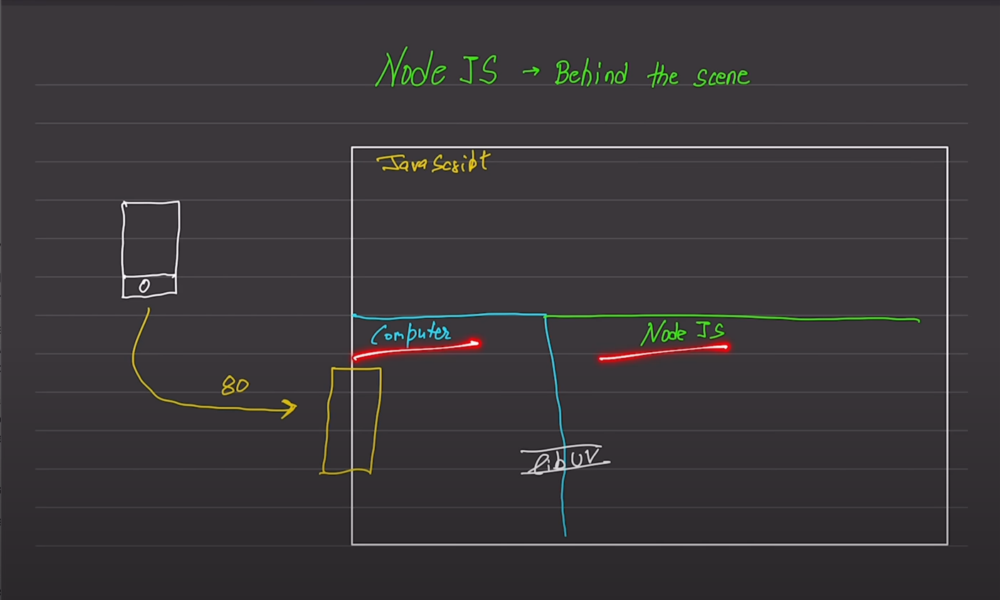

# Core Concepts of NodeJS:

### Event Emitter:
Node.js Event Emitter is a module that allows objects in Node.js to emit custom events and register listeners to those events. It provides a way to implement the observer pattern, where objects can subscribe to events and get notified when those events occur.

Example code:
```
const EventEmitter = require('events');

// Create an instance of EventEmitter
const myEmitter = new EventEmitter();

// Register a listener for 'myEvent'
myEmitter.on('myEvent', (data) => {
  console.log('Event occurred with data:', data);
});

// Emit 'myEvent' with some data
myEmitter.emit('myEvent', { message: 'Hello, world!' });
```

### Streams:
Streams are objects in Node.js that let you read or write data continuously. They provide an abstraction for handling streaming data, allowing you to work with data in chunks rather than loading it all into memory at once. Streams are especially useful for handling large datasets or data from external sources, such as files or network requests.

Example code:
```
const fs = require('fs');

// Create a readable stream to read data from a file
const readableStream = fs.createReadStream('input.txt');

// Create a writable stream to write data to a file
const writableStream = fs.createWriteStream('output.txt');

// Pipe data from the readable stream to the writable stream
readableStream.pipe(writableStream);
```

**Note: Abstraction ka matlab hai kisi cheez ke complex parts ko chhupana aur sirf zaroori cheezein dikhana. Jaise ki, agar tum car chalana chahte ho, toh tumhein engine aur gear system ka pura kaam samajhne ki zarurat nahi hai. Sirf steering wheel aur pedals ki madad se car chalayi ja sakti hai. Isi tarah se, abstraction programming mei bhi hoti hai jahan hum complex code ko simple aur easy to understand tarike se likhte hain taki hume code likhne aur usko samajhne mein asani ho.**

### libuv
libuv is a multi-platform support library in C that provides asynchronous I/O, threading, file system access, and other core functionalities needed for building networking and filesystem-related software. It serves as the underlying platform abstraction library for Node.js, handling non-blocking I/O operations and providing a consistent API across different operating systems.



