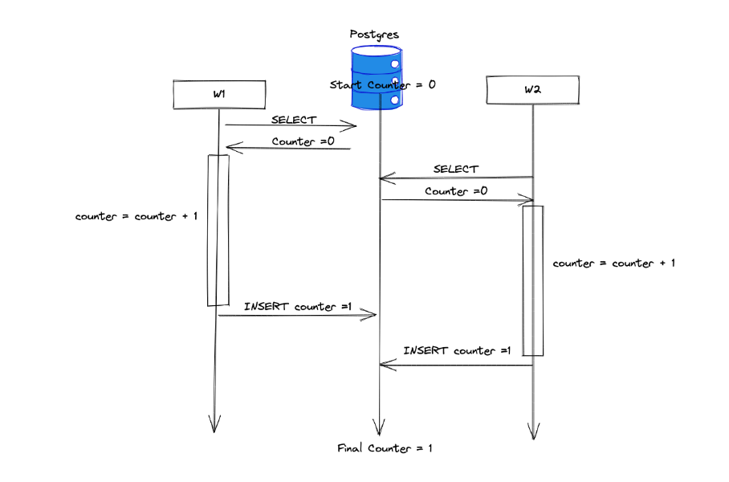
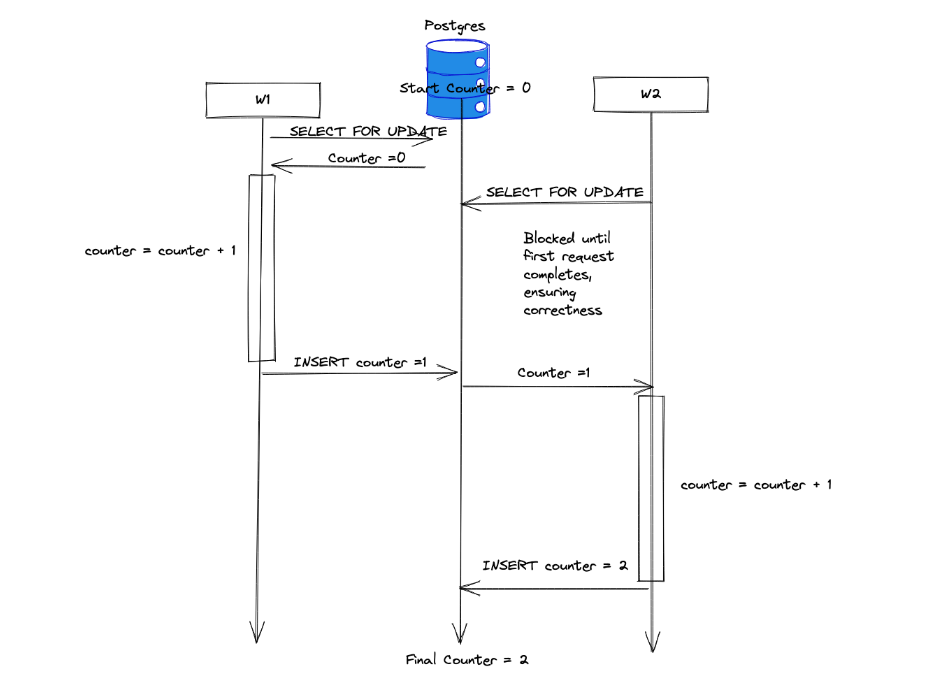

## Race Condition
Logical race conditions are errors that produce logically incorrect results, but no overt programming error. Logical race conditions are triggered when multiple operations are happening concurrently. Logical race conditions are common in sql based web systems. Multiple web requests can occur simultaneously, each triggering a corresponding database request. The concurrent web requests can trigger database to access the same resources at the same time.

## Fixes

### SELECT FOR UPDATE synchronization
Fixing the data race requires synchronizing access to the counter. SELECT FOR UPDATE is one of many strategies for synchronizing access to a set of rows in a relation dabase.

Adding FOR UPDATE to a query "locks" access to the resources returned by the select query, ensuring that only a single transaction can modify the resources at a single time.

